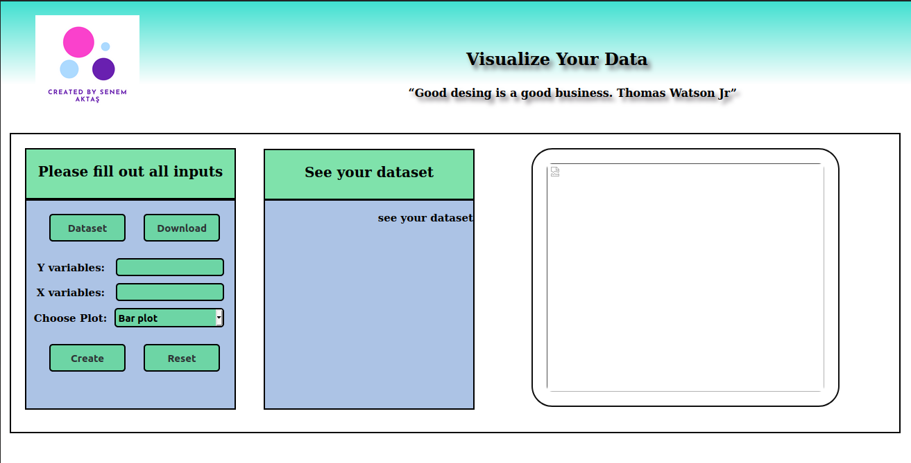

# My_DataSet_Visualization_App

 

|FlaskApp
- ----|FlaskApp
- --------|templates
-         - html files are here
- --------|static
-         - css and javascript files are here

### Sources:
- https://github.com/ibrahimokdadov/upload_file_python
- https://blog.miguelgrinberg.com/post/handling-file-uploads-with-flask
- https://www.youtube.com/watch?v=TLgVEBuQURA
- https://stackabuse.com/reading-and-writing-xml-files-in-python/
- https://www.geeksforgeeks.org/reading-and-writing-xml-files-in-python/
- https://stackoverflow.com/questions/63013821/upload-manipulate-and-save-files-in-python-flask
- https://werkzeug.palletsprojects.com/en/1.0.x/datastructures/#werkzeug.datastructures.FileStorage
- Learn Flask for Python - Full Tutorial: https://www.youtube.com/watch?v=Z1RJmh_OqeA github link : https://github.com/jakerieger/FlaskIntroduction
